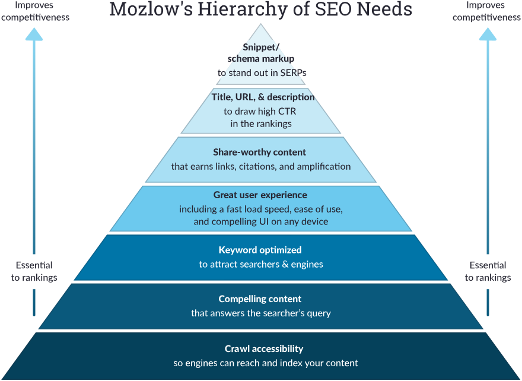

<!-- [](https://leogiesen.de/#/) -->
[](https://v2.vuejs.org/) 
[](https://leogiesen.de/#/) 

[](https://opensource.org/license/mit) 


# Portfolio - Leo Giesen


This project is deployed at [leogiesen.de](https://leogiesen.de/#/).
The original version of my portfolio can be inspected [here](https://github.com/lgiesen/portfolio-v1), which I created with HTMl5 CSS3 and JavaScript when I was 18.
 <!-- and on [Netlify](https://giesen.netlify.app/): [](https://app.netlify.com/sites/giesen/deploys) -->

## Project Setup

1. [VS Code](https://code.visualstudio.com "VS Code") is the recommended code editor
2. [Node.js](https://nodejs.org/en/download/ "Node")
3. [Vue.js](https://v3.vuejs.org/guide/installation.html#cli): `npm install -g @vue/cli #Install Command Line Interface`

Check your versions:

```
   node --version              # v16.14.2
   npm --version               # 8.5.0
   vue --version               # @vue/cli 5.0.8
```

### Serve/Start Front-end - Compiles and hot-reloads for development

```
npm run serve
#or start via User Interface with: vue ui
```

### Build for Production

```
npm run build #Compiles and minifies for production
```

To publish the changes, the "dist" directory contents are to be copied and pushed to the [portfolio-v2-dist](https://github.com/lgiesen/portfolio-v2-dist) repository because the hosting is based on it. This must be performed because the hosting plan is unable to build from production by itself.

## General Advice for Web Projects

### SEO (Search Engine Optimization)

- Keep visitors on your website (dwell time) by providing excellent content (!) (define important keywords, which people search to get to your website)
- Improve loading speed (see Improve Performance)
- Optimize your HTML
  - Use alt attributes in images so that the search engine knows what you display
  - Use aria tags for more complicated displayed content, e.g., sliders
  - Use article tags for Bots to know what main content the site presents
- Increase your Click-Through-Rate (CTR)
- Make use of metadata (located in head), e.g. description tag displayed in google search results
- Responsive Web Design ([Mobile Friendly Test](https://search.google.com/test/mobile-friendly))
- Linked by other sources, e.g. social media and other websites
- Tools & Guidelines:

  - [Google Starter Guide](https://developers.google.com/search/docs/beginner/seo-starter-guide)

    
   
   (see [Moz](https://moz.com/beginners-guide-to-seo))

### Improve Performance

- Reduce the image size with a [compressor](http://jpeg-optimizer.com/)
- Avoid CDNs
- Tools & Guidelines:
  - [Check Page Speed](https://developers.google.com/speed/pagespeed/insights/)
